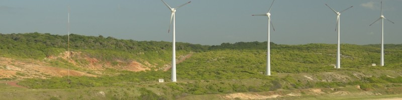

   

  

# Alex Back
*Electrical Engineer* at 8.2 Renewable Energy Experts

Renewable energy consultant with solid experience accumulated during 12 years working with small hydro and wind projects, actually working with the development of GW-rated solar energy plants. Have interest in data science and web development. 

My credentials include a Specialization on Small Hydro Plants from Universidade Federal de Itajubá (UNIFEI) and a bachelor degree in Electrical Engineering from Universidade Federal de Santa Catarina (UFSC), both institutions of higher education and advanced research, rated as top and prestigious engineering schools in Brazil.

**Background in:** .

**Links:**
* [Blog](http://sigmoidal.ai)
* [LinkedIn](https://www.linkedin.com/in/alexback)
* [Medium](https://www.medium.com)

## Projects:

### Python Crash Course ###
* **Hello World:** http://bit.ly/3ptHb8d
* **Cre cre cre:** https://bit.ly/

---

